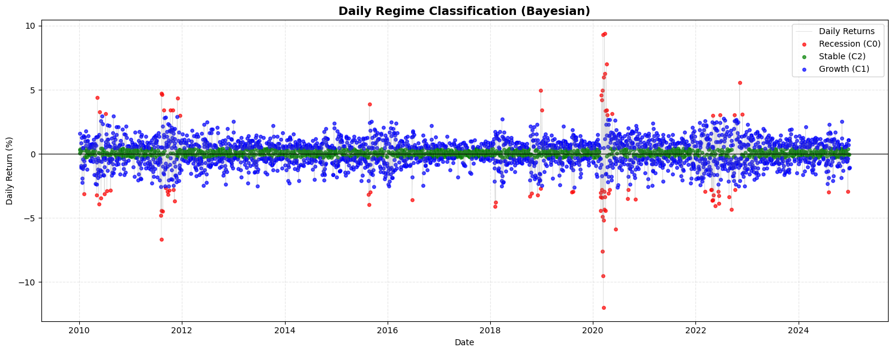
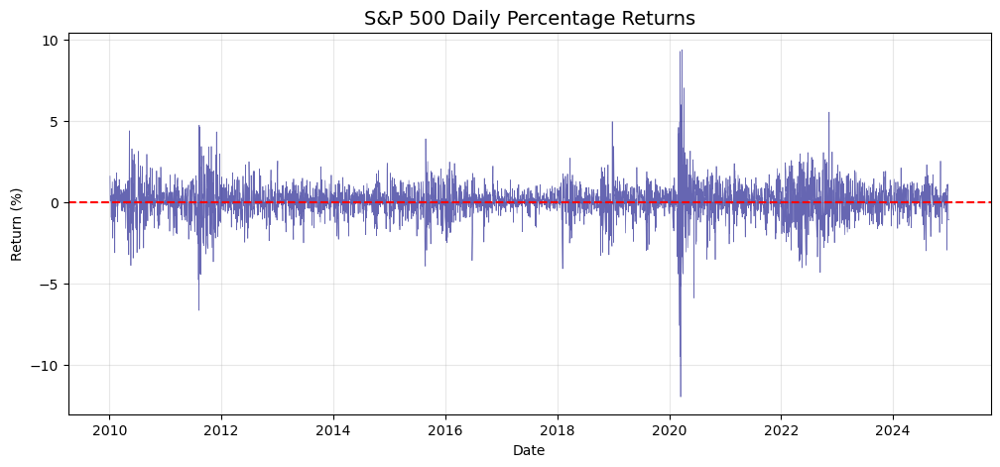
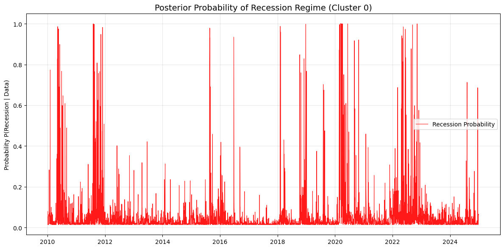
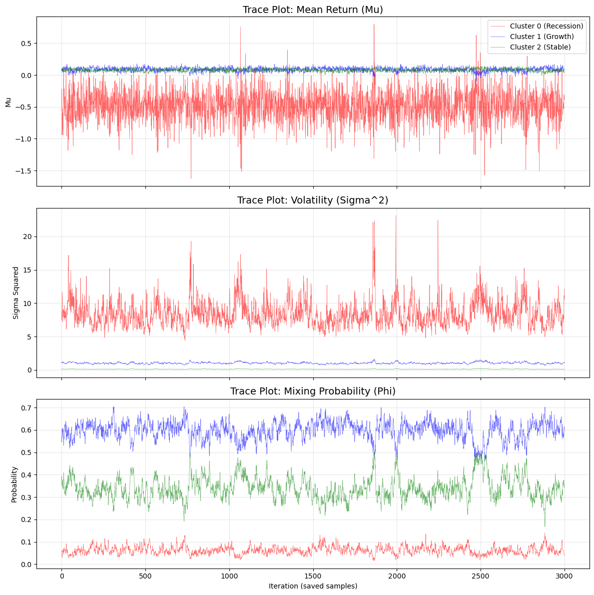

# Bayesian Market Regime Detection with Gibbs Sampling



Bayesian finite mixture modeling of S&P500 returns using a custom Gibbs sampler for latent market regime detection.


**Keywords:** Bayesian inference, Gibbs sampling, finite mixture model, latent variable model, market regime detection, MCMC, S&P500

---

## 1. Project Overview

Financial returns often exhibit volatility clustering and regime-dependent behavior that cannot be fully captured by a single probability distribution.

This project applies a Bayesian finite mixture model to daily S&P500 returns in order to identify latent market states such as recession, stable, and growth regimes.

A custom Gibbs sampling algorithm was implemented from scratch to estimate posterior distributions for regime-specific parameters and latent state assignments.

---

## 2. Research Objective

This project investigates whether Bayesian mixture modeling can effectively identify hidden market regimes from financial return data.

The main objectives are:

- Estimate latent market states using a finite mixture of Normal distributions
- Implement Gibbs sampling for posterior inference
- Analyze regime-specific return and volatility behavior
- Evaluate posterior convergence and clustering consistency
- Examine time-varying crisis probabilities in financial markets

## 3. Model Specification

The project models S&P500 daily returns using a Bayesian finite mixture of Normal distributions.

Each observation is assumed to belong to one of several latent market regimes, represented by a hidden state variable $z_t$.

For each regime, the model estimates:

- Mean return ($\mu_k$)
- Return volatility / variance ($\sigma_k^2$)
- Mixing probability ($\phi_k$)

The number of regimes was fixed at:

- $K = 3$

corresponding to:

- Recession / Crisis regime
- Stable market regime
- Growth / Bull market regime

This framework allows the model to capture regime-dependent behavior and volatility clustering commonly observed in financial markets.


## 4. Bayesian Inference Method

Bayesian inference was performed using a custom Gibbs sampling algorithm implemented from scratch.

Conditionally conjugate priors were assigned to all model parameters:

- Normal priors for regime means
- Inverse-Gamma priors for regime variances
- Dirichlet prior for mixing probabilities

Posterior inference was obtained by iteratively sampling from the conditional posterior distributions of:

- Latent regime assignments ($z_t$)
- Regime means ($\mu_k$)
- Regime variances ($\sigma_k^2$)
- Mixing probabilities ($\phi_k$)

The Gibbs sampler was run for:

- 20,000 total iterations
- 5,000 burn-in iterations
- thinning interval of 5

resulting in 3,000 posterior samples used for analysis.

A random permutation step was additionally implemented to mitigate the label switching problem commonly encountered in Bayesian mixture models.


## 5. Implementation

The Gibbs sampler was implemented entirely from scratch in Python without using pre-built Bayesian inference frameworks.

For each MCMC iteration, the algorithm performs the following steps:

1. Sample latent regime assignments ($z_t$) for each observation
2. Sample regime-specific means ($\mu_k$)
3. Sample regime-specific variances ($\sigma_k^2$)
4. Sample mixing probabilities ($\phi_k$)
5. Apply a random permutation step to mitigate label switching

The implementation combines latent variable modeling, Bayesian posterior simulation, and custom MCMC computation within a fully reproducible workflow.


## 6. Data

The analysis was conducted using daily S&P500 adjusted closing prices collected over the period:

- 2009–2024

Daily percentage returns were computed from adjusted close prices and used as the input for Bayesian regime modeling.

The dataset exhibits several characteristics commonly observed in financial markets, including:

- Volatility clustering
- Heavy-tailed return behavior
- Time-varying market uncertainty

These features make financial returns particularly suitable for latent regime detection using finite mixture models.




## 7. Results

The Bayesian mixture model successfully identified distinct latent market regimes from S&P500 daily returns.

Three regimes were estimated:

- Recession / Crisis regime
- Stable market regime
- Growth / Bull market regime

The recession regime was characterized by substantially higher volatility and more extreme negative returns, while the stable and growth regimes exhibited lower volatility and more concentrated return distributions.

Posterior inference additionally revealed periods of elevated recession probability during major market stress events, including the 2020 COVID-19 market crash.



---

### Daily Regime Classification

The estimated latent states were used to classify daily market observations into regime-specific clusters.

The Bayesian clustering results clearly separate high-volatility crisis periods from more stable market environments.


---

### Posterior Summary

| Regime | Characteristics |
|---|---|
| Recession / Crisis | High volatility, negative return spikes |
| Stable | Low volatility, near-zero average returns |
| Growth / Bull | Positive average returns with moderate volatility |

The posterior distributions indicate meaningful separation between latent market states and demonstrate the effectiveness of Bayesian mixture modeling for financial regime detection.


## 8. Posterior Diagnostics

Trace plots were used to evaluate the convergence and stability of the Gibbs sampler.

The posterior samples for regime means, variances, and mixing probabilities show stable fluctuations after burn-in, suggesting that the sampler converged to a stationary posterior distribution.

The trace plots also show clear separation between the recession, stable, and growth regimes, especially in terms of volatility and regime probability.



Overall, the diagnostic results support the reliability of the posterior inference and the interpretability of the estimated market regimes.


## 9. Key Findings

- The Bayesian mixture model successfully identified distinct latent market regimes from S&P500 returns.

- High-volatility crisis periods were clearly separated from stable and growth market environments.

- The posterior recession probability increased significantly during major market stress events, including the 2020 COVID-19 crash.

- Stable and growth regimes exhibited similar average returns but differed substantially in volatility behavior.

- The Gibbs sampler demonstrated stable convergence and effective posterior mixing after burn-in.

- Label switching mitigation was necessary to obtain interpretable and consistent posterior inference across market regimes.

---

## 10. Repository Structure

```plaintext
bayesian-market-regime-detection/
│
├── notebooks/
│   └── bayesian_market_regime_detection.ipynb
│
├── figures/
│   ├── SnP_Daily.png
│   ├── recession_regime.png
│   ├── Daily_regime.png
│   └── Mean_Return.png
│
├── data/
│   └── sp500_returns.csv
│
├── requirements.txt
└── README.md
```

---

## 11. Reproducibility

The project was designed to ensure reproducible Bayesian inference and MCMC simulation results.

Simulation settings:

- Random seed: 78
- Total MCMC iterations: 20,000
- Burn-in period: 5,000 iterations
- Thinning interval: 5

The repository contains the complete workflow for:

- Data preprocessing
- Bayesian model specification
- Gibbs sampling
- Posterior analysis
- Market regime visualization

---

## 12. Tools and Libraries

The project was implemented using:

- Python
- NumPy
- pandas
- SciPy
- statsmodels
- matplotlib
- Jupyter Notebook

---

## 13. Future Improvements

Possible extensions of this project include:

- Comparing alternative numbers of latent regimes ($K$)
- Adding Bayesian model selection criteria
- Extending the framework to Markov-switching models
- Applying the model to additional financial assets and indices
- Performing posterior predictive checks and out-of-sample validation

---

## 14. Korean Summary (한국어 요약)

이 프로젝트는 Bayesian finite mixture model과 Gibbs sampling을 활용하여  
S&P500 수익률 데이터에서 숨겨진 시장 상태(regime)를 추정한 프로젝트입니다.

시장 상태를 recession, stable, growth regime으로 구분하였으며,  
COVID-19 금융위기와 같은 고변동성 시기를 효과적으로 탐지할 수 있음을 확인했습니다.

또한 Gibbs sampler를 직접 구현하고, posterior inference 및 label switching 문제를 함께 분석했습니다.
